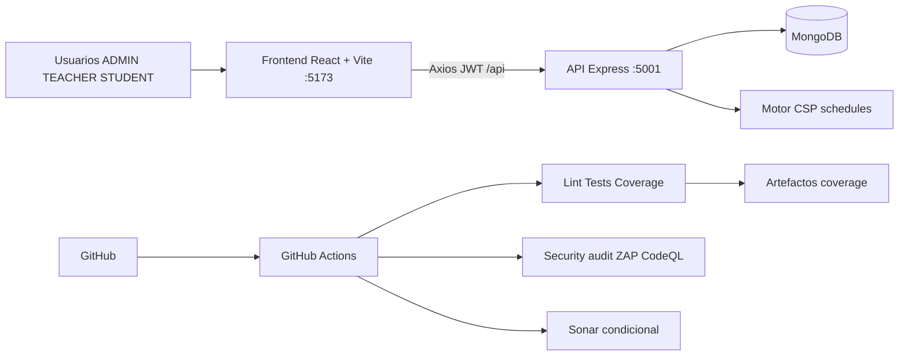
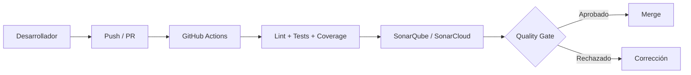
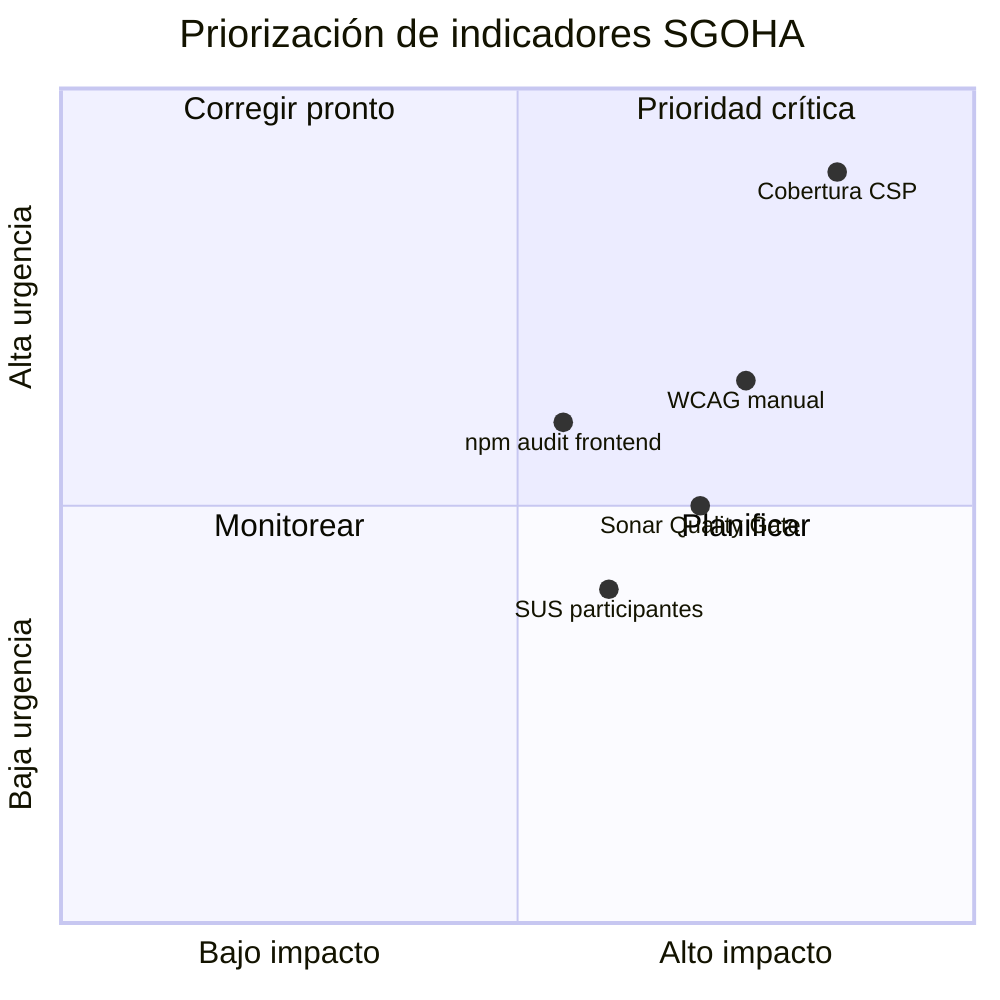
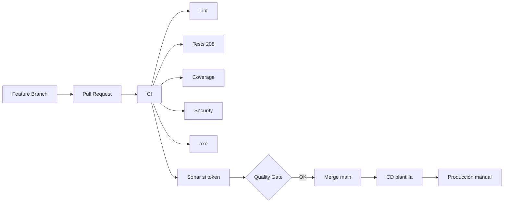

# 🛡️ Informe técnico integral del sistema SGOHA

**Punto 7.2:** Análisis SonarQube · Interpretación de métricas · Análisis OWASP · Validación WCAG 2.2 · Análisis SUS

---

## Datos de identificación

| Campo | Valor |
| ----- | ----- |
| **Proyecto** | SGOHA — Sistema de Generación Óptima de Horarios Académicos |
| **Versión analizada** | 2.0.0 |
| **Rama** | `main` |
| **Commit** | `fb539a2` (evaluación local 2026-06-17) |
| **Fecha** | 2026-06-17 |
| **Equipo responsable** | Equipo SGOHA / QA académico |
| **Stack** | React 19 · Vite 8 · Tailwind 4 · Node/Express 5 · Mongoose 8 · MongoDB · Jest · Cypress |
| **Entorno de evaluación** | macOS local · Node 20 · MongoDB Docker (opcional) · GitHub Actions (ubuntu-latest) |

---

## Resumen ejecutivo

| Aspecto | Resultado |
| ------- | --------- |
| **Propósito** | Expediente técnico reproducible de calidad, seguridad, accesibilidad y usabilidad |
| **Herramientas** | ESLint, Jest, Cypress+axe, npm audit, CodeQL, SonarQube (config), OWASP ZAP (CI), Lighthouse (config), SUS (script) |
| **Hallazgos principales** | Cobertura global ~30 %; motor CSP con huecos de prueba; `qs` corregido; 5 hallazgos npm frontend en monitoreo |
| **Mejoras realizadas** | Helmet, rate-limit, ESLint en verde, axe multi-pantalla, workflows CI/Security/Sonar, documentación 7.2 |
| **Nivel técnico** | 🟢 PMV con automatización madura; 🟡 Sonar/ZAP/SUS usuarios requieren credenciales o participantes |
| **Riesgos residuales** | JWT en localStorage; cobertura baja en horarios/CSP; CD plantilla sin despliegue activo |
| **Estado CI/CD** | ⚙️ CI ejecuta lint, build, 208 tests, cobertura, audit, a11y |

---

## Arquitectura evaluada

**Módulos verificados:** autenticación, usuarios, cursos, docentes, disponibilidad, aulas, estudiantes, matrículas, franjas HORALV, restricciones, horarios, dashboard, configuración, portales docente/alumno.

---

## Alcance de la evaluación

| Capa | Ruta | Incluido |
| ---- | ---- | -------- |
| Frontend | `frontend/src/` | ✅ UI, rutas, servicios Axios |
| Backend | `backend/src/` | ✅ API REST, middlewares, servicios |
| Pruebas | `tests/`, `cypress/` | ✅ Jest + Cypress (raíz) |
| Excluido | `backend/routes/` legado, `dist/`, secretos `.env` | Documentado |

---

## Metodología

1. Inspección del repositorio y dependencias (`package.json`, workflows).
2. Ejecución local: `npm test`, `npm run test:coverage`, `npm run lint`, `npm run audit:security`.
3. Configuración SonarQube (`sonar-project.properties`, `docker-compose.sonar.yml`).
4. Análisis OWASP Top 10 sobre código y CI.
5. Pruebas axe automatizadas (`npm run test:a11y`).
6. Instrumento SUS + script de cálculo (sin datos ficticios de usuarios).
7. Consolidación en este informe y [`docs/README.md`](./README.md).

---

## 7.2.a Análisis SonarQube

### Configuración 🟢

Archivo [`sonar-project.properties`](../sonar-project.properties): fuentes `frontend/src`, `backend/src`; tests `tests/`, `cypress/`; LCOV en `tests/reports/coverage/*/lcov.info`.

### Entorno reproducible ⚙️

[`docker-compose.sonar.yml`](../docker-compose.sonar.yml) — SonarQube Community + PostgreSQL, puerto 9000, red aislada de MongoDB.

Guía: [`reportes/sonar/GUIA_EJECUCION_SONARQUBE.md`](./reportes/sonar/GUIA_EJECUCION_SONARQUBE.md)

### Calidad local ejecutada

| Artefacto | Resultado |
| --------- | --------- |
| ESLint frontend | 0 errores, 3 advertencias — [`frontend-quality.txt`](./reportes/sonar/frontend-quality.txt) |
| Lint backend | ✅ `node --check` — [`backend-quality.txt`](./reportes/sonar/backend-quality.txt) |
| Build frontend | ✅ `vite build` |
| Cobertura | Ver [`coverage-summary.md`](./reportes/sonar/coverage-summary.md) |

### Métricas SonarQube

| Métrica | Inicial | Posterior | Estado | Interpretación | Evidencia |
| ------- | ------: | --------: | ------ | -------------- | --------- |
| Quality Gate | — | — | 🔵 Requiere SonarQube/Cloud | No inferible desde ESLint | SON-01 |
| Bugs | — | — | 🔵 Requiere ejecución Sonar | Análisis semántico AST | SON-02 |
| Vulnerabilities | — | — | 🔵 Requiere ejecución Sonar | Complementa npm audit | SON-02 |
| Security Hotspots | — | — | 🔵 Requiere ejecución Sonar | Revisión manual en panel | SON-02 |
| Code Smells | — | — | 🔵 Requiere ejecución Sonar | Deuda estructural | SON-02 |
| Duplicated Lines | — | — | 🔵 Requiere ejecución Sonar | — | SON-02 |
| Coverage | — | **30,3 %** líneas | 🟡 | Desde Jest; Sonar importará LCOV | [`coverage-summary.md`](./reportes/sonar/coverage-summary.md) |
| Reliability Rating | — | — | 🔵 Requiere SonarQube | — | SON-01 |
| Security Rating | — | — | 🔵 Requiere SonarQube | — | SON-01 |
| Maintainability | — | — | 🔵 Requiere SonarQube | — | SON-01 |
| Technical Debt | — | — | 🔵 Requiere SonarQube | — | SON-01 |
| Cognitive Complexity | — | — | 🔵 Requiere SonarQube | — | SON-02 |

### Flujo Sonar

### Conclusión 7.2.a

Configuración y cobertura LCOV **listas**. Métricas de panel Sonar **requieren ejecución** con token (`SONAR_TOKEN`) — workflow [`sonar.yml`](../.github/workflows/sonar.yml) preparado.

---

## 7.2.b Interpretación de métricas

> Detalle ampliado: [`COVERAGE_ANALYSIS.md`](./COVERAGE_ANALYSIS.md)

No se repiten cifras aquí; se interpreta su **significado para SGOHA**.

| Dimensión | Lectura para el proyecto |
| --------- | ------------------------ |
| **Cobertura ~30 %** | Los flujos de matrícula y CSP tienen poca red de seguridad automatizada; un error en prerrequisitos podría pasar desapercibido. |
| **208 tests OK** | Regresión de API y componentes críticos estable; base sólida para CI. |
| **ESLint 0 errores** | Mantenibilidad del frontend mejorada; reglas React 19 de efectos documentadas. |
| **npm audit** | Backend limpio tras fix `qs`; frontend con hallazgos en cadena dev — ver interpretación. |
| **axe 0 críticas (umbral)** | Riesgo de barreras graves en login/dashboard reducido; no sustituye checklist manual. |
| **SUS** | Sin puntuación agregada hasta aplicar protocolo con participantes. |

### Priorización (cuadrante cualitativo)

---

## 7.2.c Análisis OWASP

Informe completo: [`reportes/security/OWASP_ANALYSIS.md`](./reportes/security/OWASP_ANALYSIS.md)

| Control | Estado |
| ------- | ------ |
| Helmet + rate limit + body limit | ✅ Corregido |
| RBAC JWT | 🟢 Conforme |
| bcrypt + exclusión password | 🟢 Conforme |
| npm audit `qs` | ✅ Corregido (6.15.2) |
| OWASP ZAP en CI | ⚙️ Automatizado (stack local o URL externa) |
| CodeQL | ⚙️ Semanal en GitHub |

---

## 7.2.d Validación WCAG 2.2

Informe: [`reportes/accessibility/WCAG_2_2_VALIDATION.md`](./reportes/accessibility/WCAG_2_2_VALIDATION.md)

| Elemento | Estado |
| -------- | ------ |
| `lang="es"` | ✅ |
| Cypress axe (7 specs) | ⚙️ `npm run test:a11y` |
| Lighthouse config | ⚙️ `lighthouserc.json` |
| Checklist manual | 🧑‍💻 [`WCAG_MANUAL_CHECKLIST.md`](./reportes/accessibility/WCAG_MANUAL_CHECKLIST.md) |

**Nivel:** Cumplimiento de criterios **evaluados** con objetivo WCAG 2.2 AA.

---

## 7.2.e Análisis SUS

Informe: [`reportes/usability/SUS_ANALYSIS.md`](./reportes/usability/SUS_ANALYSIS.md)

| Entregable | Estado |
| ---------- | ------ |
| Cuestionario 10 ítems | ✅ |
| CSV plantilla | ✅ |
| `scripts/calculate-sus.js` | ✅ |
| Protocolo ≥ 5 participantes | 🧑‍💻 Validación humana posterior |
| Puntuación SGOHA real | No aplicable sin CSV de respuestas |

---

## Integración CI/CD

Documentación: [`CI_CD_GITHUB_ACTIONS.md`](./CI_CD_GITHUB_ACTIONS.md)

| Workflow | Función |
| -------- | ------- |
| `ci.yml` | Lint, build, tests, cobertura, audit, a11y |
| `security.yml` | audit, secret scan, ZAP |
| `codeql.yml` | Análisis estático seguridad |
| `sonar.yml` | SonarCloud/self-hosted si `SONAR_TOKEN` |
| `cd-template.yml` | Plantilla despliegue — activación manual |

---

## Mejoras implementadas

- ✅ Middleware seguridad (`helmet`, rate-limit login/API, límite JSON)
- ✅ ESLint frontend sin errores bloqueantes; CI sin `continue-on-error`
- ✅ 208 pruebas Jest; cobertura HTML consolidada
- ✅ Cypress axe por módulo (login, dashboard, cursos, docentes, disponibilidad, matrícula, horarios)
- ✅ `qs` actualizado; documentación npm audit
- ✅ Expediente `docs/` enlazado y en español

---

## Comparación antes y después

| Indicador | Antes | Después |
| --------- | ----- | ------- |
| Tests Jest | ~62 | **208** ✅ |
| ESLint CI | continue-on-error | **Bloqueante, 0 errores** ✅ |
| Seguridad HTTP | Parcial | **Helmet + rate limit** ✅ |
| Documento 7.2 | Esqueleto con placeholders | **Expediente completo** ✅ |
| Sonar local | — | **docker-compose + guía** ✅ |
| SUS | — | **Instrumento + script** ✅ |
| Backend npm audit | 1 moderada | **0** ✅ |

---

## Evidencias técnicas

Índice: [`evidencias/README.md`](./evidencias/README.md)

| Área | Ruta |
| ---- | ---- |
| Sonar | `docs/reportes/sonar/` |
| OWASP | `docs/reportes/security/` |
| WCAG | `docs/reportes/accessibility/` |
| SUS | `docs/reportes/usability/` |
| CI | `docs/evidencias/ci-cd/` |

---

## Riesgos residuales

| Riesgo | Nivel | Mitigación |
| ------ | ----- | ---------- |
| Token JWT en localStorage | 🟠 | CSP, sanitizar XSS, considerar httpOnly cookie |
| Cobertura CSP/horarios baja | 🟠 | Ampliar tests integración API |
| Sonar sin token en GitHub | 🟡 | Configurar `SONAR_TOKEN` |
| SUS sin participantes | 🔵 | Aplicar protocolo publicado |
| CD no desplegado | 🟡 | Activar `cd-template.yml` con proveedor |

---

## Conclusiones

SGOHA dispone de un **expediente técnico 7.2 reproducible**: pruebas automatizadas sólidas, controles OWASP en backend, accesibilidad axe en flujos clave e instrumentación SUS lista. Las métricas SonarQube de panel y la puntuación SUS real completan el ciclo cuando se ejecuten SonarScanner y sesiones con usuarios.

---

## Recomendaciones

1. Configurar secretos Sonar en GitHub y capturar Quality Gate (SON-01).
2. Aumentar cobertura en `csp.service.js` y `enrollment.service.js`.
3. Ejecutar checklist WCAG manual y Lighthouse en staging.
4. Aplicar protocolo SUS con ≥ 5 participantes anonimizados.
5. Resolver hallazgos npm frontend con `npm audit fix` controlado.
6. Activar CD hacia entorno de staging documentado.

---

## Anexos

| Anexo | Enlace |
| ----- | ------ |
| A — Plan de pruebas | [TEST_PLAN.md](./TEST_PLAN.md) |
| B — Evidencias de prueba | [TEST_EVIDENCES.md](./TEST_EVIDENCES.md) |
| C — Matriz de hallazgos | [MATRIZ_HALLAZGOS.md](./plantillas/MATRIZ_HALLAZGOS.md) |
| D — Cuestionario SUS | [CUESTIONARIO_SUS.md](./plantillas/CUESTIONARIO_SUS.md) |
| E — Guía Sonar | [GUIA_EJECUCION_SONARQUBE.md](./reportes/sonar/GUIA_EJECUCION_SONARQUBE.md) |
